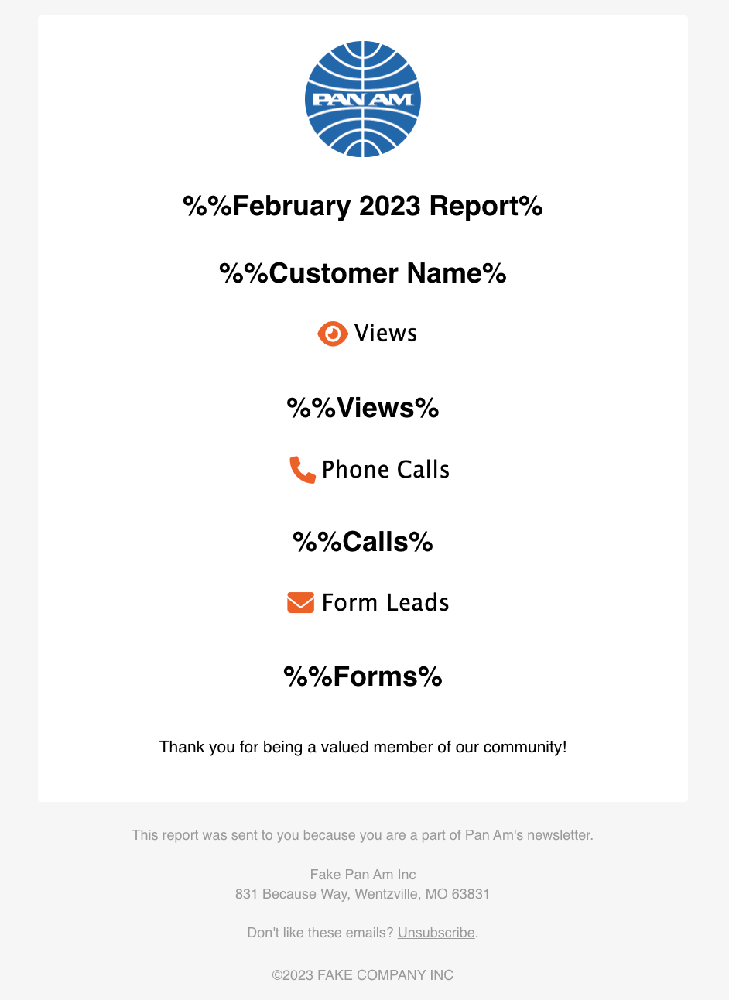

# HTML Email Template for Sending Emails from Your Application

## What is it

This is a simple HTML email template that you can use to send emails from your application. The template looks nice in most email clients, including mobile.

You can view the HTML page [here](https://philwonski.github.io/html-email-template/HTML_Email_Template.html) and below is a screen grab:

Note that I am not the original author of this template. I have been using it for years and modifying it slightly in various apps. I'm not sure who the original author is, but I thank them! HTML emails are a pain!

## Who is it for

This template is for developers who want to send emails from their application with a nice HTML template. 

You will need to be able to send emails from your application. If you're looking for a way to send emails from your application, check out [AWS SES](https://aws.amazon.com/ses/), which I typically connect to using [Pipedream](https://pipedream.com/).

AWS SES is quick to set up in sandbox mode and try out; but note that you will need to apply for verification before moving out of the sandbox. You can read more about that [here](https://docs.aws.amazon.com/ses/latest/DeveloperGuide/request-production-access.html).

## How to use it

It's just a simple HTML page. The idea is to replace the placeholder text and images with your own content programmatically, kind of like a mail merge. I have a few of the fields I like to change in the template wrapped in `%%` to make it easier to find them.

